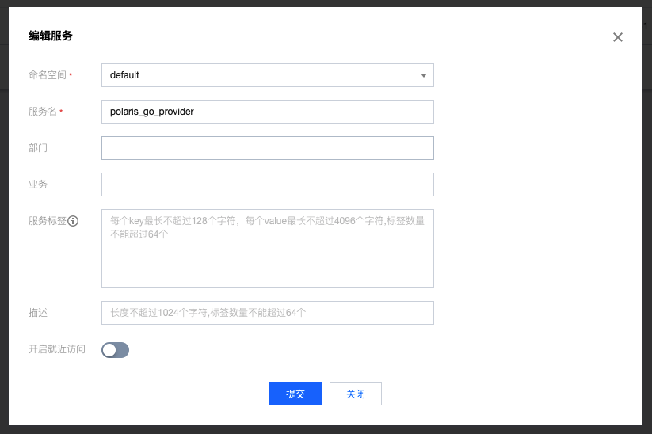
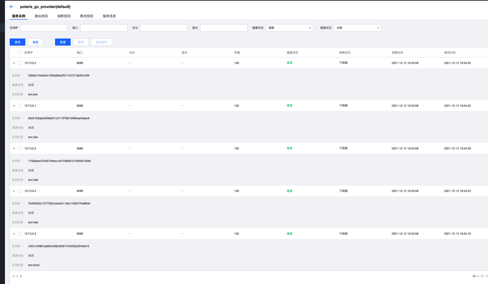

# Polaris Go

[中文文档](./README-zh.md)

## Polaris uses service fuse function

Polaris supports fusing abnormal services, interfaces, instances, or instance groups in a timely manner to reduce the request failure rate.

## How To Build

- linux/mac build command
```
go build -o circuitbreaker
```
- windows build command
```
go build -o circuitbreaker.exe
```

## How To Use

### Create Service

Create the corresponding service through the Polaris console in advance. If it is installed through a local one-click installation package, open the console directly in the browser through 127.0.0.1:8091



### Create Service Instance



### Change setting

To specify the Polaris server address, you need to edit the polaris.yaml file and fill in the server address

```
global:
  serverConnector:
    addresses:
    - 127.0.0.1:8091
```

### Execute Program

Directly execute the generated executable program

- linux/mac run command
```
./circuitbreaker --service="your service name" --namespace="your namespace name"
```

- windows run command
```
./circuitbreaker.exe --service="your service name" --namespace="your namespace name"name"
```

### Desired result

After running, only the unbroken instances will be printed out in the end

```
➜  circuitbreaker git:(feat_demo) ✗ ./circuitbreaker --service=polaris_go_provider
2021/12/12 17:12:19 start to invoke GetInstancesRequest operation
2021/12/12 17:12:19 choose instances 127.0.0.2:8080 to circuirbreaker
2021/12/12 17:12:24 instance GetInstances 0 is 127.0.0.1:8080
2021/12/12 17:12:24 instance GetInstances 1 is 127.0.0.5:8080
2021/12/12 17:12:24 instance GetInstances 2 is 127.0.0.4:8080
2021/12/12 17:12:24 instance GetInstances 3 is 127.0.0.3:8080
```