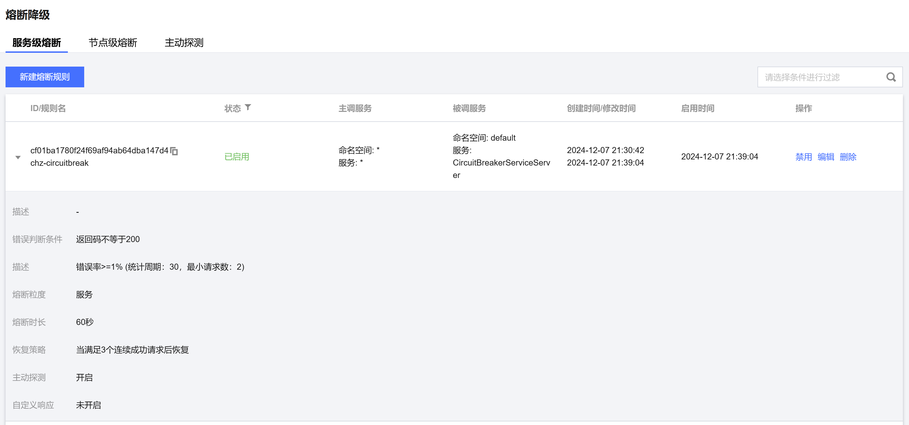

# Polaris Go

[English](./README.md) | 中文

## 使用实例故障熔断

北极星支持及时熔断异常的服务、接口、实例或者实例分组，降低请求失败率。
## 如何使用

### 构建可执行文件

构建 provider

```
# linux/mac
cd ./provider
go build -o provider

# windows
cd ./consumer
go build -o provider.exe
```

构建 consumer

```
# linux/mac
cd ./consumer
go build -o consumer

# windows
cd ./consumer
go build -o consumer.exe
```
### 进入控制台

预先通过北极星控制台创建对应的服务，如果是通过本地一键安装包的方式安装，直接在浏览器通过127.0.0.1:8080打开控制台

### 设置熔断规则



### 修改配置

指定北极星服务端地址，需编辑polaris.yaml文件，填入服务端地址

```
global:
  serverConnector:
    addresses:
    - 127.0.0.1:8091
```

### 执行程序

### 执行程序

运行构建出的**provider**可执行文件

```
# linux/mac运行命令
./provider

# windows运行命令
./provider.exe
```

运行构建出的**consumer**可执行文件

```
# linux/mac运行命令
./provider

# windows运行命令
./provider.exe
```

### 验证

快速的发起多次**curl**请求命令

```
-- 第一次发起请求
curl -H 'user-id: polaris' http://127.0.0.1:18080/echo

Hello, My host : 127.0.0.1:8888
Hello, My host : 127.0.0.1:9999
...
Hello, My host : 127.0.0.1:9999

-- 关闭某些provider，在发起请求

"Hello, My host : %s:%d", svr.host, svr.port
dial tcp 127.0.0.1:37907: connect: connection refused

<多次调用触发熔断>

it's fallback
...
