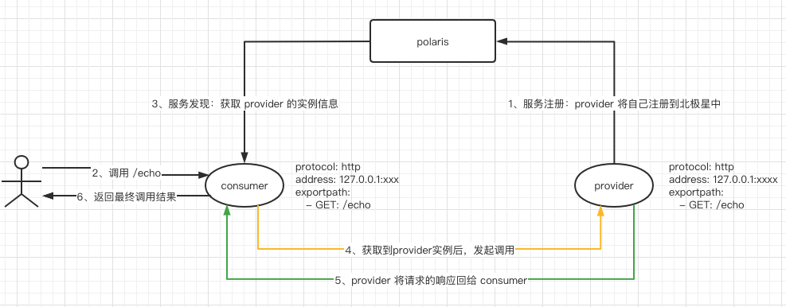

# Polaris Go

[English Document](./README.md)

## 说明

该快速体验demo分为两个部分

- consumer : 主调服务，通过`http`协议暴露了一个`/echo`的方法供用户访问
- provier : 被调服务，通过`http`协议暴露了一个`/echo`的方法供主调服务访问

调用关系图如下



## 如何使用

### 构建命令

- 构建 provider 的可执行文件


```
# linux/mac构建命令
cd ./provider
go build -o provider

# windows构建命令
cd ./consumer
go build -o provider.exe
```

- 构建 consumer 的可执行文件

```
# linux/mac构建命令
cd ./consumer
go build -o consumer

# windows构建命令
cd ./consumer
go build -o consumer.exe
```
### 修改配置

指定北极星服务端地址，需编辑polaris.yaml文件，填入服务端地址

```
global:
  serverConnector:
    addresses:
    - 127.0.0.1:8091
```

### 执行程序

- 运行 provider 的可执行文件

```
# linux/mac运行命令
./provider

# windows运行命令
./provider.exe
```

- 运行 consumer 的可执行文件


```
# linux/mac运行命令
./consumer

# windows运行命令
./consumer.exe
```

### 验证

```
curl http://127.0.0.1:18080/echo

Hello, I'm EchoServerGolang Provider
```