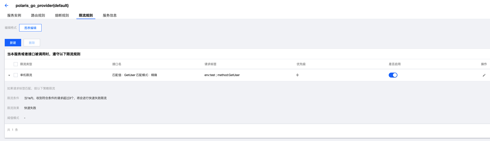

# Polaris Go

## 北极星使用服务限流功能

北极星支持针对不同的请求来源和系统资源进行访问限流，避免服务被压垮。

## 如何构建

直接依赖go mod进行构建

- linux/mac构建命令
```
go build -o ratelimit
```
- windows构建命令
```
go build -o ratelimit.exe
```

## 如何使用

### 创建服务

预先通过北极星控制台创建对应的服务，如果是通过本地一键安装包的方式安装，直接在浏览器通过127.0.0.1:8091打开控制台


### 创建限流规则



### 创建服务实例


### 修改配置

指定北极星服务端地址，需编辑polaris.yaml文件，填入服务端地址

```
global:
  serverConnector:
    addresses:
    - 127.0.0.1:8091
```

### 执行程序

直接执行生成的可执行程序

- linux/mac运行命令
```
./ratelimit --service={your service name} --namespace={your namespace name} --labels={your labels, ex: k1:v1,k2:v2} --concurrency={your request concurrency}
```

- windows运行命令
```
./ratelimit.exe --service={your service name} --namespace={your namespace name} --labels={your labels, ex: k1:v1,k2:v2} --concurrency={your request concurrency}
```

### 期望结果

运行后，最终三个协程将打印`quota-ret : 0`，表示获得了请求配额；两个协程打印`quota-ret : -1`，标识当前被限流

```
➜  ratelimit git:(feat_demo) ✗ ./ratelimit --service=polaris_go_provider --labels="env:test,method:GetUser" --concurrency=5 
2021/12/12 18:10:45 labels: map[env:test method:GetUser]
2021/12/12 18:10:45 thread 2 starts, sleep 23ms
2021/12/12 18:10:45 thread 3 starts, sleep 21ms
2021/12/12 18:10:45 thread 1 starts, sleep 21ms
2021/12/12 18:10:45 thread 4 starts, sleep 21ms
2021/12/12 18:10:45 thread 0 starts, sleep 22ms
2021/12/12 18:10:45 receive quit signal urgent I/O condition
2021/12/12 18:10:45 stop closed
2021/12/12 18:10:45 thread 0 request quota-ret : 0
2021/12/12 18:10:45 thread 3 request quota-ret : 0
2021/12/12 18:10:45 thread 1 request quota-ret : 0
2021/12/12 18:10:45 thread 2 request quota-ret : -1
2021/12/12 18:10:45 thread 4 request quota-ret : -1
2021/12/12 18:10:45 thread 0 stops
2021/12/12 18:10:45 thread 2 stops
2021/12/12 18:10:45 thread 3 stops
2021/12/12 18:10:45 thread 1 stops
2021/12/12 18:10:45 thread 4 stops
2021/12/12 18:10:45 total Pass 3, all 5
```