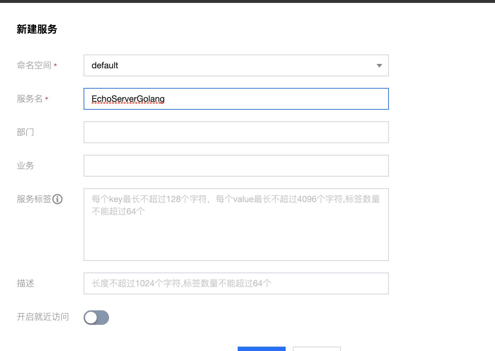
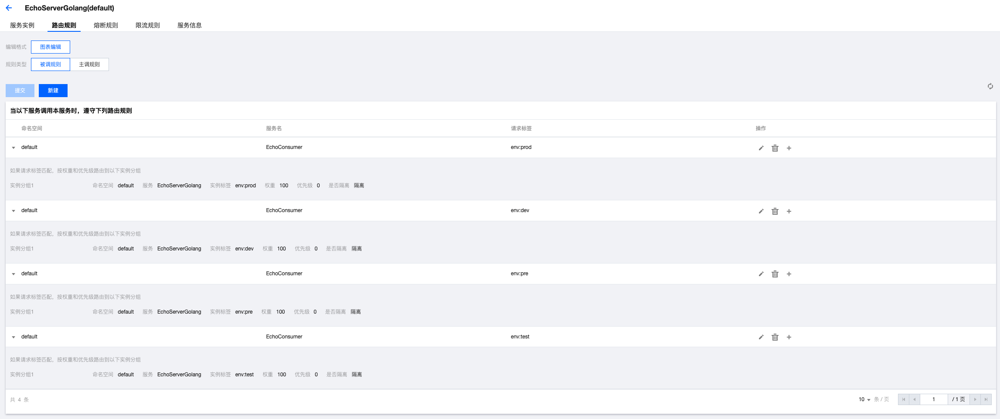

# Polaris Go [English Document](./README.Md) ## běijíxīng shǐyòng fúwù lùyóu gōngnéng běijíxīng zhīchí gēnjù qǐngqiú biāoqiān, shílì biāoqiān hé biāoqiān pǐpèi guīzé, duì xiàn shàng liúliàng jìnxíng dòngtài diàodù, kěyǐ yìngyòng yú àn dìyù jiùjìn, dānyuán huà gélí hé jīn sī què fābù děng duō zhǒng chǎngjǐng. ## Rúhé gòujiàn > provider zhíjiē yīlài go mod jìnxíng gòujiàn - linux/mac gòujiàn mìnglìng ``` cd./Provider go build -o provider ``` - windows gòujiàn mìnglìng ``` cd./Consumer go build -o provider.Exe ``` > consumer - linux/mac gòujiàn mìnglìng ``` cd./Consumer go build -o consumer ``` - windows gòujiàn mìnglìng ``` cd./Consumer go build -o consumer.Exe ``` ## rúhé shǐyòng ### chuàngjiàn fúwù yùxiān tōngguò běijíxīng kòngzhì tái chuàngjiàn duìyìng de fúwù, rúguǒ shì tōngguò běndì yī jiàn ānzhuāng bāo de fāngshì ānzhuāng, zhíjiē zài liúlǎn qì tōngguò 127.0.0.1:8091 Dǎkāi kòngzhì tái  ### chuàngjiàn lùyóu guīzé  ### xiūgǎi pèizhì zhǐdìng běijíxīng fúwù duān dìzhǐ, xū biānjí polaris.Yaml wénjiàn, tián rù fúwù duān dìzhǐ ``` global: ServerConnector: Addresses: - 127.0.0.1:8091 ``` ### Zhíxíng chéngxù zhíjiē zhíxíng shēngchéng de kě zhíxíng chéngxù, duìyú provider jìnchéng > provider - linux/mac yùnxíng mìnglìng ``` ./Provider --port=20000 --metadata="env=dev" > provider-20000.Log 2>&1& ./Provider --port=20001 --metadata="env=test" > provider-20001.Log 2>&1& ./Provider --port=20002 --metadata="env=pre" > provider-20002.Log 2>&1& ./Provider --port=20003 --metadata="env=prod" > provider-20003.Log 2>&1& ``` - windows yùnxíng mìnglìng ``` ./Provider.Exe --port=20000 --metadata="env=dev" > provider-20000.Log 2>&1& ./Provider.Exe --port=20001 --metadata="env=test" > provider-20001.Log 2>&1& ./Provider.Exe --port=20002 --metadata="env=pre" > provider-20002.Log 2>&1& ./Provider.Exe --port=20003 --metadata="env=prod" > provider-20003.Log 2>&1& ``` > consumer - linux/mac yùnxíng mìnglìng ``` ./Consumer --selfNamespace={selfName} --selfService=EchoConsumer ``` - windows yùnxíng mìnglìng ``` ./Consumer.Exe --selfNamespace={selfName} --selfService=EchoConsumer ``` ### yànzhèng tōngguò shèzhì qǐngqiú tóu cānshù***env***de zhí, shíxiàn lùyóu dào bùtóng de fúwù shílì ``` curl -H'env: Pre' http://127.0.0.1:18080/Echo Hello, I'm EchoServerGolang Provider env=pre ```
展开
1,780 / 5,000
翻译结果
#Polaris Go

[English Document](./README.md)

## Polaris uses the service routing function

Polaris supports dynamic scheduling of online traffic based on request tags, instance tags, and tag matching rules, which can be applied to various scenarios such as proximity by region, unit isolation, and canary release.

## How to build

> provider

Build directly on go mod

- linux/mac build command
````
cd ./provider
go build -o provider
````
- windows build command
````
cd ./consumer
go build -o provider.exe
````

> consumer

- linux/mac build command
````
cd ./consumer
go build -o consumer
````
- windows build command
````
cd ./consumer
go build -o consumer.exe
````


## how to use

### Create service

Create the corresponding service through the Polaris console in advance. If it is installed through the local one-click installation package, open the console directly in the browser through 127.0.0.1:8091



### Create routing rules



### Change setting

To specify the address of the Polaris server, you need to edit the polaris.yaml file and fill in the server address

````
global:
  serverConnector:
    addresses:
    - 127.0.0.1:8091
````
### execute program

Directly execute the generated executable program, for the provider process

> provider

- linux/mac run command
````
./provider --port=20000 --metadata="env=dev" > provider-20000.log 2>&1 &
./provider --port=20001 --metadata="env=test" > provider-20001.log 2>&1 &
./provider --port=20002 --metadata="env=pre" > provider-20002.log 2>&1 &
./provider --port=20003 --metadata="env=prod" > provider-20003.log 2>&1 &
````

- windows run command
````
./provider.exe --port=20000 --metadata="env=dev" > provider-20000.log 2>&1 &
./provider.exe --port=20001 --metadata="env=test" > provider-20001.log 2>&1 &
./provider.exe --port=20002 --metadata="env=pre" > provider-20002.log 2>&1 &
./provider.exe --port=20003 --metadata="env=prod" > provider-20003.log 2>&1 &
````

> consumer


- linux/mac run command
````
./consumer --selfNamespace={selfName} --selfService=EchoConsumer
````

- windows run command
````
./consumer.exe --selfNamespace={selfName} --selfService=EchoConsumer
````

### verify

Route to different service instances by setting the value of the request header parameter ***env***

````
curl -H 'env: pre' http://127.0.0.1:18080/echo

Hello, I'm EchoServerGolang Provider env=pre
```` 