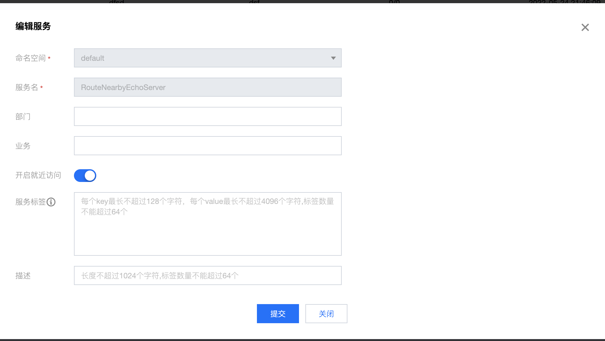

# Polaris Go

English | [中文](./README-zh.md)

## Use the nearest routing function

Polaris supports the implementation of the nearest routing by region according to the regional information of the instance.

## How To Use

### Build the executable

build provider

````
# linux/mac build command
cd ./provider
go build -o provider

# windows build command
cd ./consumer
go build -o provider.exe
````

build consumer

````
# linux/mac build command
cd ./consumer
go build -o consumer

# windows build command
cd ./consumer
go build -o consumer.exe
````

### Create service

Create the corresponding service through the Polaris console in advance. If it is installed through the local one-click installation package, open the console directly in the browser through 127.0.0.1:8080

### Open the nearest route for the service



### Change setting

To specify the address of the Polaris server, you need to edit the polaris.yaml file and fill in the server address

````
global:
  serverConnector:
    addresses:
    - 127.0.0.1:8091
````
### execute program

Run the built **provider** executable

````
for ((i=1; i<=3; i++))
do
    # Set the locale information
    export POLARIS_INSTANCE_REGION=china
    export POLARIS_INSTANCE_ZONE=ap-guangzhou
    export POLARIS_INSTANCE_CAMPUS=ap-guangzhou-${i}
    
    # linux/mac run command
    ./provider > provider-20000.log 2>&1 &
then
````

Run the built **consumer** executable

````
# Set the locale information
export POLARIS_INSTANCE_REGION=china
export POLARIS_INSTANCE_ZONE=ap-guangzhou
export POLARIS_INSTANCE_CAMPUS=ap-guangzhou-1

# linux/mac run command
./consumer --selfNamespace={selfName} --selfService=EchoConsumer

# windows run command
./consumer.exe --selfNamespace={selfName} --selfService=EchoConsumer
````

### Verify

Implement the nearest routing based on the regional information of the instance

````
curl -H 'env: pre' http://127.0.0.1:18080/echo

RouteNearbyEchoServer Consumer, MyLocInfo's : {"Region":"china","Zone":"ap-guangzhou","Campus":"ap-guangzhou-5"}, host : 127.0.0.1:18080 => Hello, I' m RouteNearbyEchoServer Provider, MyLocInfo's : {"Region":"china","Zone":"ap-guangzhou","Campus":"ap-guangzhou-5"}, host : 127.0.0.1:37341
````