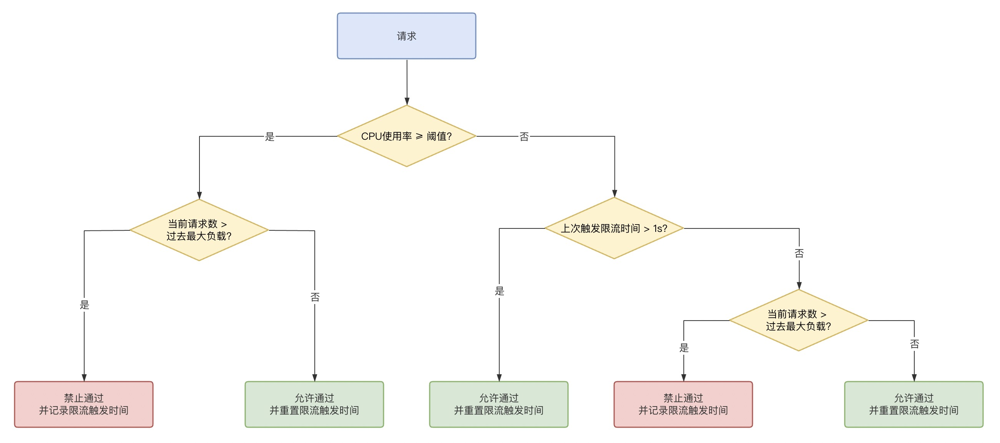

# BBR
BBR CPU 自适应限流组件参考了 [TCP BBR](https://en.wikipedia.org/wiki/TCP_congestion_control#TCP_BBR) 的思想，以及 [阿里 Sentinel](https://github.com/alibaba/Sentinel/wiki/系统自适应限流) 的算法。

传统的限流思路为：超过一定负载就拦截流量进入，负载恢复就放开流量，这样做有延迟性，最终是按照果来调节因，无法取得良好效果。

BBR 的思路为：根据应用的请求处理时间、请求成功数、最大并发数这些指标，计算当前应用能承载的最大并发请求量，再对比当前系统并发量，判断是否应当拦截本次流量，即所谓"自适应"。

BBR 的源码实现可参考：
- [乔卓越 - 深入理解云原生下自适应限流技术原理与应用](https://mp.weixin.qq.com/s?__biz=MzA4ODg0NDkzOA==&mid=2247493581&idx=1&sn=62feb928915eaeb9082b58737829cf19&chksm=90215828a756d13e36cf77fe980f90810236296e5289259e085ccda7a539979c0716b5c8a601&scene=126&sessionid=1634901423&key=92c891f823e779d59fb069c1f73467971e77ea57597e6305cd46077c5115f63362682acb7d71e10dce269b227d3823d11ef9e5ce4116448fda19babccca00938bb97159b2d212d3a739c461a317a413867734e4ff39439da6d669943638ebb44fb5d44b939ae294b9b2eb42fa68fe939e1e4b21d8d806bf0299ecfea6bfa0c80&ascene=0&uin=MTg4NzU0NzUzNw%3D%3D&devicetype=Windows+10+x64&version=63040026&lang=zh_CN&exportkey=AyWZkGTg8xpxVEKYWHzdFvE%3D&pass_ticket=aPS1JJrPDslKIxzL8eyKwCG9loYdUIDyJU6iO22glE0yHlC3foSNMEFaklAFVWTj&wx_header=0&fontgear=2#)
- [yuemoxi - 从kratos分析BBR限流源码实现](https://juejin.cn/post/7004848252109455368)


# 插件设计
本插件将 BBR 限流器适配成 `QuotaBucket` 接口（主要实现 `GetQuotaWithRelease` 判断限流方法），以及 `ServiceRateLimiter` 接口（实现 `InitQuota` 初始化方法）。

由于 BBR 限流需要记录请求通过数、当前并发数、请求耗时，因此没有复用原来 `QuotaBucket` 接口中的 `GetQuota` 方法，而是新增了一个方法 `GetQuotaWithRelease`，该方法相比于 `GetQuota` 方法，返回参数中多了一个 `func()`，供业务方在业务逻辑处理完成后调用。

由于 CPU 使用率指标为实例单机指标，因此 CPU 限流只适用于单机限流，不适用于分布式限流，未实现分布式限流器需要实现的接口。


## 初始化 InitQuota
kratos - BBR 初始化需要三个入参：
```
CPUThreshold: CPU使用率阈值，超过该阈值时，根据应用过去能承受的负载判断是否拦截流量 
window: 窗口采样时长，控制采样多久的数据
bucket: 桶数，BBR 会把 window 分成多个 bucket，沿时间轴向前滑动。如 window=1s, bucket=10 时，整个滑动窗口用来保存最近 1s 的采样数据，每个小的桶用来保存 100ms 的采样数据。当时间流动之后，过期的桶会自动被新桶的数据覆盖掉
```
这三个入参，从 `apitraffic.Rule` 结构体中解析，直接使用了结构体中的 `MaxAmount`、`ValidDuration`、`Precision` 字段


## 判断限流 GetQuotaWithRelease
调用了 BBR 的 `Allow()` 方法

其内部执行 `shouldDrop()` 方法，其执行流程如下：



流程中比较关键的一步是计算应用可承受的最大请求量，由下列方法计算：
```go
func (l *BBR) maxInFlight() int64 {
	return int64(math.Floor(float64(l.maxPASS()*l.minRT()*l.bucketPerSecond)/1000.0) + 0.5)
}
```
- `maxPass * bucketPerSecond / 1000` 为每毫秒处理的请求数
- `l.minRT()` 为 单个采样窗口中最小的响应时间
- 0.5为向上取整
- 当CPU利用率过载时，就需要通过上述预期公式进行干预。在服务运行期间持续统计当前服务的请求数，即 `inFlight`，通过在滑动窗口内的所有buckets中比较得出最多请求完成数 `maxPass`，以及最小的耗时 `minRT`，相乘就得出了预期的最佳请求数 `maxInFlight`。
- `maxInFlight` 表示系统能同时处理的最多请求数，这个水位是一个平衡点，保持该水位可以最大化系统的处理能力，超过该水位则会导致请求堆积。
- 通过 `inFlight` 与 `maxInFlight` 对比，如果前者大于后者那么就已经过载，进而拒绝后续到来的请求防止服务过载。

## 代码结构
```go
├── core       BBR核心算法实现
├── cpu        CPU使用率采集相关实现
├── window     滑动窗口相关实现
├── bucket.go  实现 `QuotaBucket` 接口
├── plugin.go  实现 `Plugin` 接口
```
